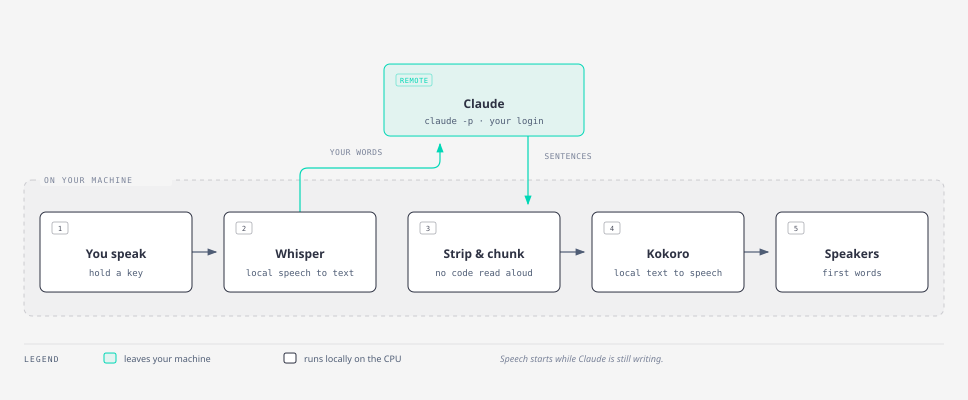
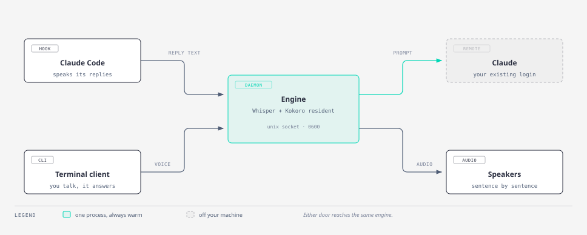

<p align="center">
  
</p>

# claudechat

**claudechat gives Claude a voice.** It reads Claude's replies out loud through your
speakers, and it listens when you talk back — so you can ask a question without typing it,
or keep working while Claude explains what it just did.

The part that makes it unusual: **the speech never leaves your computer.** Turning your
voice into text, and Claude's text into speech, both happen on your own processor. No
speech service, no audio uploaded anywhere, no account to create. Only the question itself
goes to Claude, over the login you already have.

There is also no API key. claudechat talks to Claude through the Claude Code command-line
tool you are already signed into, so it runs on the subscription you already pay for.

> **Status: early, but genuinely usable.** The engine works end to end and has 187 tests.
> The latency work landed and was re-measured: a pre-warmed turn reaches first audio in
> about 3.2 seconds (median of three runs), inside the 3.5-second target that the old
> 4.8-second build missed. macOS support is written but has never been run on a Mac.
> The remaining rough edges are covered plainly in [Where it's rough](#where-its-rough).

---

## What it does

<p align="center">
  
</p>

---

## Quickstart

You need three things already installed: the [`claude`](https://claude.com/claude-code)
command (signed in), [`uv`](https://docs.astral.sh/uv/) for Python, and a command-line
audio tool — PipeWire on Linux, or `brew install sox` on macOS.

```bash
git clone https://github.com/dgdev25/claudechat.git
cd claudechat
./start.sh --install
```

`--install` sets everything up once: it checks your tools, installs the Python
dependencies, downloads the voice model (about 340 MB, checked against a known
fingerprint), writes a config file, and registers a hook so Claude Code can speak.

Then, from anywhere:

```bash
claudechat on       # Claude Code now speaks its replies
claudechat off      # silence
claudechat status   # what's on, which voice
```

That's the whole thing. `on` starts the speech engine by itself and `off` shuts it down,
so nothing is running in the background unless you asked for it.

**Speech is off until you turn it on.** That's deliberate: a tool that talks without being
asked will eventually read something aloud you didn't want read aloud.

### Want a keyboard shortcut instead?

```bash
./scripts/bind-hotkey.sh          # Super+V toggles speech (GNOME)
```

On macOS the same script explains how to bind `claudechat toggle` with skhd, Karabiner or
Automator, since macOS has no scriptable global-hotkey API.

---

## How it works

<p align="center">
  <picture>
    <source media="(prefers-color-scheme: dark)" srcset="assets/workflow-dark.svg">
    
  </picture>
</p>

Reading left to right: you speak, and a local model called **Whisper** turns that into
text without touching the network. The text goes to Claude — the one step that leaves your
machine. Claude streams its answer back a piece at a time, so claudechat doesn't wait for
the whole thing: it strips out code blocks and formatting (you don't want backticks read
aloud), splits what's left into sentences, and hands each one to **Kokoro**, a local
text-to-speech model.

The useful consequence is that **you hear the first sentence while Claude is still writing
the rest.** That hides most of the waiting.

---

## Two ways to use it

**Talk to it directly.** Run `uv run claudechat`, press Enter to start recording, speak,
press Enter again. It shows you what it heard — so a mis-transcription is obvious rather
than mysterious — then answers out loud. Press Enter while it is speaking to interrupt
it and ask something else; the conversation carries on from where it was. Set
`hands_free = true` under `[speech]` in the config and the keys go away entirely: it
records when you speak and stops when you fall silent, like a phone call.

**Or let it narrate Claude Code.** This is the one most people will want. Once the hook is
installed, every reply in a normal Claude Code session gets spoken as a short summary:
the facts, no code, no detail. You keep working and listen. With `voice_replies = true`
under `[hook]`, it listens for a few seconds after each summary — answer out loud and
your words land on the clipboard, ready to paste into Claude Code.

These two compose nicely with Claude Code's own `/voice` feature. `/voice` handles input
(hold space, talk, it types for you) and claudechat handles output. **Keep `/voice`
enabled** — the two don't collide.

---

## Under the hood

<p align="center">
  <picture>
    <source media="(prefers-color-scheme: dark)" srcset="assets/architecture-dark.svg">
    
  </picture>
</p>

There's one long-lived process — the **engine** — and it keeps both speech models loaded in
memory. That matters: loading them takes about half a minute, so if every reply started a
fresh process you'd wait half a minute every time. Instead the engine stays warm and
speaking costs nothing extra.

Both entry points reach it the same way, through a **Unix socket** — a private channel that
lives in the filesystem rather than on a network port. It's readable only by you, and the
engine checks the identity of whatever connects to it. That's deliberate: this endpoint
spends your Claude quota and makes your speakers talk, so it should not be something any
program on the machine — or any web page — can poke.

---

## Choosing a voice

54 voices across nine languages, including eight British ones.

```bash
uv run python scripts/list_voices.py     # see them all
```

Then set it in `~/.config/claudechat/config.toml`:

```toml
[speech]
tts_voice = "bm_fable"    # British male. Others: bm_george, bf_emma, af_heart …
tts_speed = 1.0
```

No restart needed for the speech toggle; a voice change takes effect next time the engine
starts.

---

## Where it's rough

Being straight with you about the parts that aren't finished:

- **Interrupting costs one slow turn.** A pre-warmed turn reaches first audio in about
  3.2 seconds, but barging in drops the Claude process, and the turn right after an
  interrupt pays a cold start (about 4.9 seconds) unless you pause long enough for the
  background re-warm to finish. The local speech layer also came in slower than its
  0.8-second budget in re-measurement (transcription varied 0.35–0.81 s) and hasn't
  been chased down yet.
- **macOS is written but unverified.** Every dependency has Mac builds and the
  platform-specific pieces — audio, autostart, the socket permission check — all have Mac
  implementations with tests. But nobody has run it on a Mac yet, so treat it as untested.
  Linux is verified.
- **The new conversation features are tested with fakes, not a microphone.** Hands-free
  mode (`hands_free = true` — speak to record, silence ends the turn), Enter-to-interrupt
  while Claude is speaking, the thinking tone, and clipboard voice replies
  (`voice_replies = true`) all pass their tests, but nobody has held a real conversation
  through them yet. Interrupting by voice mid-reply is deliberately not built: the
  microphone hears the speakers, and that needs echo handling first.
- **One dependency is GPL-licensed.** The speech synthesiser pulls in `phonemizer`, which
  is GPL-3.0. Fine for personal use, since that licence applies when you distribute
  software rather than when you run it — but it would need replacing before publishing
  this as a permissively licensed project.

---

## Going deeper

| Document | What's in it |
|---|---|
| [`docs/PRD.md`](docs/PRD.md) | Numbered requirements and the measured results against each target |
| [`docs/superpowers/specs/`](docs/superpowers/specs/) | The design, including the security model |
| [`docs/adr/`](docs/adr/) | Fourteen decision records — *why* each choice was made, including the ones that were wrong first |

The ADRs are the interesting ones if you want to understand the reasoning rather than the
code. They include the mistakes: audio that silently never played, a socket server that
died after a single message, and a key-hold detector that gave up 250 ms into a 500 ms
press.

---

## Running the tests

```bash
uv run pytest -q          # 101 tests
```

Tests that download models or spend Claude quota are marked `slow` and `live` so they can
be skipped.
